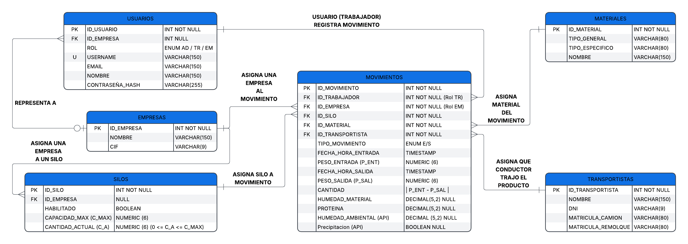

# 🌾 Gestión de Silos y Movimientos de Grano

Aplicación web para gestionar la **recepción y salida de mercancía (cereal) en un almacén de silos**, con trazabilidad completa de cada movimiento: quién lo registró, de qué empresa es la mercancía, en qué silo se almacenó, qué calidad tenía y qué condiciones meteorológicas había ese día.

Proyecto final de **2º DAW**.

---

## 📌 Descripción del problema

En un almacén de grano llegan camiones de distintas empresas (cooperativas, agricultores...) a descargar o a cargar mercancía. Hay que:

- Registrar quién es el dueño de la mercancía, el conductor y el vehículo.
- Pesar el camión a la entrada y a la salida para obtener la cantidad real (tara).
- Analizar la calidad del grano (humedad y proteína).
- Controlar el contenido de cada silo sin superar nunca su capacidad.
- Poder demostrar, en caso de reclamación del cliente por la humedad, **qué tiempo hacía el día del movimiento** (humedad relativa ambiental y precipitación).
- Permitir que cada empresa consulte **solo su propio histórico**.

---

## 🛠️ Tecnologías

| Capa | Tecnología |
|---|---|
| Backend | Java + **Spring Boot** (Spring Web, Spring Data JPA, Spring Security) |
| Frontend (desarrollo) | **Thymeleaf**, integrado en el backend |
| Frontend (objetivo) | SPA en JavaScript, separada del backend (posiblemente **React**) consumiendo una API REST |
| Base de datos | **PostgreSQL** (en Docker o en servidor, por decidir) |
| Datos meteorológicos | API externa de histórico meteorológico (p. ej. Open-Meteo) |

> **Evolución prevista:** mientras el frontend esté en Thymeleaf, los controladores devuelven vistas. Para facilitar la migración, la lógica de negocio se mantiene en una capa de servicios independiente, de modo que el paso a una API REST + React solo requiera añadir controladores `@RestController`.

---

## 🗂️ Modelo de datos



### Entidades

| Entidad | Descripción |
|---|---|
| `USUARIOS` | Personas que acceden al sistema (administradores, trabajadores y representantes de empresa). |
| `EMPRESAS` | Clientes propietarios de la mercancía y de los silos que tienen asignados. |
| `SILOS` | Silos del almacén, con su capacidad máxima y su contenido actual. |
| `MATERIALES` | Catálogo de tipos de grano (tipo general, tipo específico y nombre). |
| `TRANSPORTISTAS` | Conductor y vehículo (DNI, matrículas de camión y remolque). |
| `MOVIMIENTOS` | Cada entrada o salida de mercancía, con pesos, calidad y datos meteorológicos. |

### Relaciones

| Relación | Cardinalidad | Significado |
|---|---|---|
| `EMPRESAS` → `USUARIOS` | 1 : N (opcional) | Un usuario con rol empresa *representa a* una empresa. Una empresa puede tener varios usuarios. |
| `EMPRESAS` → `SILOS` | 1 : N | Una empresa tiene asignados varios silos. Un silo pertenece a una sola empresa a la vez. |
| `USUARIOS` → `MOVIMIENTOS` | 1 : N | Un trabajador *registra* muchos movimientos. |
| `EMPRESAS` → `MOVIMIENTOS` | 1 : N | Cada movimiento pertenece a la empresa dueña de la mercancía. |
| `SILOS` → `MOVIMIENTOS` | 1 : N | Cada movimiento afecta a un silo. |
| `MATERIALES` → `MOVIMIENTOS` | 1 : N | Cada movimiento mueve un tipo de material. |
| `TRANSPORTISTAS` → `MOVIMIENTOS` | 1 : N | Cada movimiento lo realiza un conductor con un vehículo. |

### Decisiones de diseño

- **`ID_Empresa` se guarda también en `MOVIMIENTOS`** (aunque el silo ya tenga empresa). Un silo puede cambiar de dueño cuando se vacía, y así el histórico de cada empresa permanece intacto: cada empresa solo ve sus movimientos y los silos que usó en su momento.
- **Un silo vacío conserva su último dueño** hasta que se reasigna (o queda a `NULL` si no se asigna a nadie).
- **Los movimientos se registran una vez finalizados** (cuando ya existen el peso de entrada y el de salida), por lo que no existen estados intermedios.
- **`Cantidad` es un dato derivado**: `|Peso_Entrada − Peso_Salida|`. Se calcula como columna generada en PostgreSQL. El valor absoluto es necesario porque en una entrada el camión llega cargado y sale vacío, y en una salida ocurre al revés.
- **Ubicación del almacén**: todos los silos están en el mismo sitio, por lo que las coordenadas son una **constante de configuración** y no se guardan en base de datos.
- **Contraseñas**: solo se almacena el hash (BCrypt), nunca el texto plano.

---

## 👥 Roles de usuario

| Rol | Código | Permisos |
|---|---|---|
| Administrador | `AD` | Gestión de usuarios, empresas, silos y materiales. Consulta global. |
| Trabajador | `TR` | Registra movimientos de entrada y salida. |
| Empresa | `EM` | Consulta únicamente el histórico de sus propios movimientos y el estado de sus silos. |

---

## 🔒 Restricciones de integridad

Algunas se aplican en la propia base de datos (CHECK y triggers de `db/schema.sql`) y se refuerzan en el backend con validaciones.

1. **Rol y empresa:** si `Rol = EM`, `ID_Empresa` es obligatorio; si `Rol = AD` o `TR`, debe ser `NULL`.
2. **Quién registra:** `ID_Trabajador` debe ser un usuario con rol `TR` (o `AD`), nunca `EM`.
3. **Silo y empresa coherentes:** el silo de un movimiento debe pertenecer a la empresa del movimiento.
4. **Silo habilitado:** no se pueden registrar movimientos en un silo deshabilitado.
5. **Capacidad:** `0 ≤ Cantidad_Actual ≤ Capacidad_MAX`. Si un movimiento la incumple, se rechaza y se revierte toda la transacción.
6. **Actualización del silo:** en una entrada (`E`) se suma `Cantidad` a `Cantidad_Actual`; en una salida (`S`) se resta. Se hace en la misma transacción que la inserción del movimiento.
7. **Reasignación de silos:** un silo solo puede cambiar de empresa si `Cantidad_Actual = 0`.
8. **Coherencia temporal:** `Fecha_Hora_Salida > Fecha_Hora_Entrada`.
9. **Cantidad:** `Cantidad = |Peso_Entrada − Peso_Salida|` (columna generada).
10. **Datos opcionales (NULL):** `Humedad_Material` y `Proteina` (puede no haber análisis en una salida), `Humedad_Ambiental` y `Precipitacion` (si la API falla, se reintenta más tarde), y `Matricula_Remolque` (no todos los camiones llevan).
11. **Trazabilidad:** los movimientos no se pueden borrar, y solo pueden completarse a posteriori los campos meteorológicos. Una corrección se hace mediante un movimiento inverso.
12. **Unicidad:** `Username`, `Email`, `CIF` y `DNI` son únicos.

---

## 🔄 Flujo de ejemplo: recepción de trigo

**Situación:** un camión de la *Cooperativa Agrícola del Sur* llega al almacén con trigo duro. Un trabajador (rol `TR`) lo recibe.

1. **Identificación.** El trabajador pregunta al conductor quién es el dueño de la mercancía: *Cooperativa Agrícola del Sur*. Registra o selecciona al transportista (DNI, matrícula del camión y del remolque).
2. **Pesaje de entrada.** El camión se pesa cargado: `Peso_Entrada = 38 500 kg`. Se anota `Fecha_Hora_Entrada`.
3. **Control de calidad.** Se toma una muestra y se mide: `Humedad_Material = 11,8 %`, `Proteina = 13,2 %`.
4. **Asignación de silo.** El trabajador pregunta a la empresa a cuál de sus silos va el grano: **Silo 3**. El sistema comprueba que el silo 3 pertenece a la cooperativa, está habilitado y tiene hueco.
5. **Descarga y pesaje de salida.** El camión descarga y se vuelve a pesar vacío: `Peso_Salida = 14 200 kg`. Se anota `Fecha_Hora_Salida`.
6. **Cálculo.** `Cantidad = |38 500 − 14 200| = 24 300 kg`.
7. **Consulta meteorológica.** El backend toma la ubicación del almacén (configuración) y la fecha/hora de entrada, y consulta la API para obtener la `Humedad_Ambiental` y si hubo `Precipitacion` ese día.
8. **Registro.** En una única transacción se inserta el movimiento (`Tipo = E`) y se actualiza el silo: `Cantidad_Actual = 120 000 + 24 300 = 144 300 kg` (con `Capacidad_MAX = 300 000 kg`, el movimiento es válido).
9. **Consulta posterior.** Si la cooperativa reclama por la humedad de ese silo, el usuario `EM` consulta su histórico y se comparan la humedad del material con las condiciones ambientales del día de la entrada.

Si en el paso 8 la cantidad superase la capacidad del silo, la base de datos rechaza el movimiento y no se modifica nada.

---

## ⚙️ Configuración

### Ubicación del almacén

Situado en la carretera entre **El Cuervo de Sevilla** y **Jerez de la Frontera**. Se define como constante de configuración (`application.properties` o variables de entorno):

```properties
# Coordenadas aproximadas: ajustar a la ubicación exacta del almacén
almacen.latitud=36.77
almacen.longitud=-6.09
```

### Base de datos

Opción A: PostgreSQL en Docker.

```yaml
# docker-compose.yml
services:
  db:
    image: postgres:16
    environment:
      POSTGRES_DB: silos
      POSTGRES_USER: silos_user
      POSTGRES_PASSWORD: cambiar_password
    ports:
      - "5432:5432"
    volumes:
      - pgdata:/var/lib/postgresql/data
      - ./db/schema.sql:/docker-entrypoint-initdb.d/01-schema.sql
volumes:
  pgdata:
```

Opción B: PostgreSQL instalado en el servidor; ejecutar el script manualmente:

```bash
psql -U silos_user -d silos -f db/schema.sql
```

### Backend (Spring Boot)

```properties
spring.datasource.url=jdbc:postgresql://localhost:5432/silos
spring.datasource.username=silos_user
spring.datasource.password=${DB_PASSWORD}
spring.jpa.hibernate.ddl-auto=validate
```

> Con `ddl-auto=validate`, el esquema lo controla `db/schema.sql` (o una herramienta de migraciones como Flyway) y Hibernate solo comprueba que las entidades coinciden.

---

## 📁 Estructura del repositorio

```
.
├── README.md
├── docs/
│   └── modelo-er.png        # Diagrama entidad-relación
├── db/
│   └── schema.sql           # Script de creación de la base de datos
├── backend/                 # Spring Boot
└── frontend/                # (futuro) SPA en JavaScript
```

---

## 🗄️ Script SQL

El script completo de creación (tablas, tipos, restricciones y triggers) está en [`db/schema.sql`](db/schema.sql).

---

## 🚧 Estado del proyecto

- [x] Modelo entidad-relación
- [x] Script de base de datos
- [ ] Backend con Spring Boot
- [ ] Frontend con Thymeleaf
- [ ] Integración con la API meteorológica
- [ ] Autenticación y roles
- [ ] Migración del frontend a SPA

---

## 👤 Autor
José Pedro González Hens.
Proyecto final de 2º DAW.
